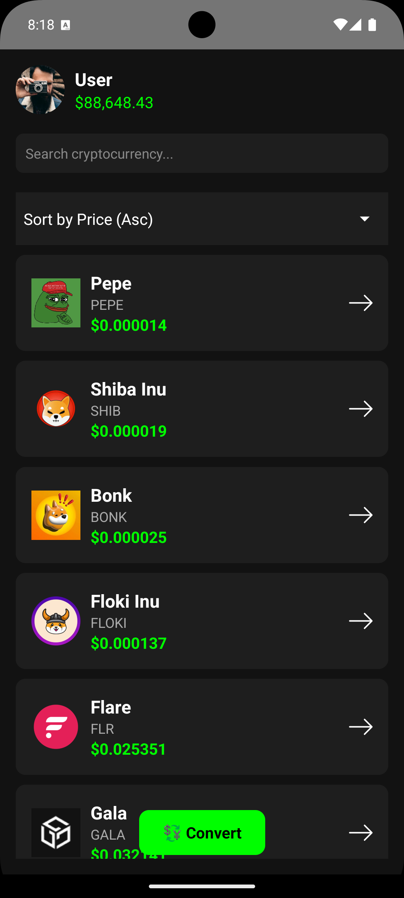
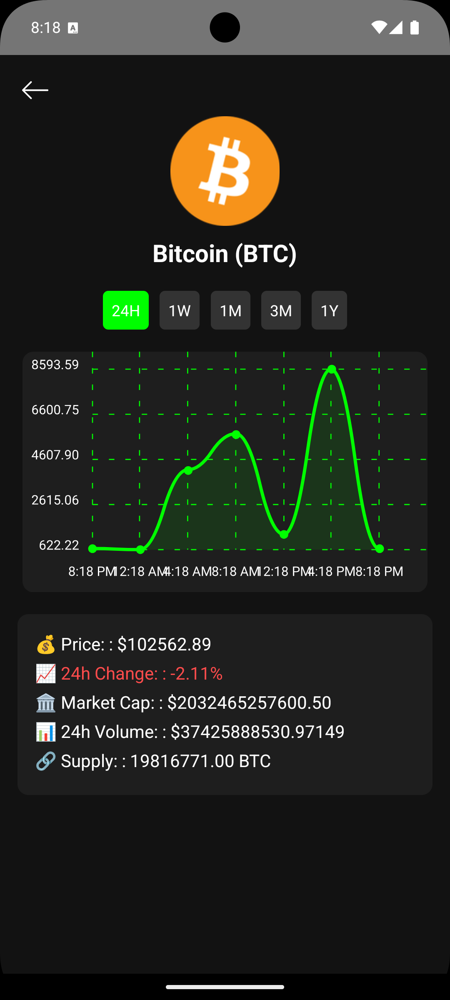

# 📱 CryptoApp

## 🚀 Descripción

CryptoApp es una aplicación de **React Native** que permite visualizar y gestionar información sobre criptomonedas en tiempo real. Permite filtrar, ordenar y ver detalles con una UI moderna e intuitiva.

## 📂 Estructura del Proyecto

```bash
src/
├── app/
│   ├── config/
│   ├── navigation/
├── modules/
│   ├── crypto/
│   │   ├── data/
│   │   ├── domain/
│   │   ├── presentation/
│   │   │   ├── components/
│   │   │   ├── screens/
│   │   │   ├── redux/
assets/
    ├── animations/
```

## 📦 Instalación y Ejecución

### 🔹 Requisitos Previos

- Node.js 18+
- Expo CLI o React Native CLI
- Android Studio / Xcode (para emuladores)

### 🔹 Instalación

```sh
git clone https://github.com/steven230500/cryptoapp.git
cd cryptoapp
npm install
```

### 🔹 Ejecución en Android

```sh
npx react-native run-android
```

### 🔹 Ejecución en iOS

```sh
npx react-native run-ios
```

## 🎥 Capturas de Pantalla y Demo

| 📱 Dashboard                                   | 📈 Detalle                                |
| ---------------------------------------------- | ----------------------------------------- |
|  |  |

### 📹 Demo en GIF

Puedes ver una demo en acción aquí:


**Cómo grabar y agregar un GIF**:

1. **Android:** Usar `adb shell screenrecord` o la grabadora de Android Studio.
2. **iOS:** Grabar con QuickTime Player.
3. Convertir el video a **GIF** con [ezgif](https://ezgif.com/video-to-gif).
4. Guardarlo en `assets/screenshots/demo.gif` y referenciarlo en el README.

## 🔗 API Utilizada

Esta app obtiene los datos desde la API de **CoinLore**:
[https://api.coinlore.net/api/tickers/](https://api.coinlore.net/api/tickers/)

## ✅ Buenas Prácticas Implementadas

- Uso de **Redux Toolkit** para manejo de estado global.
- Arquitectura **data-domain-presentation**.
- Animaciones con **react-native-reanimated** y **Lottie**.
- Manejo de errores y estados de carga.

## 👨‍💻 Autor

- **Steven Patiño** - [GitHub](https://github.com/steven230500) - [LinkedIn](https://linkedin.com/in/steven-p-0ab502126)
